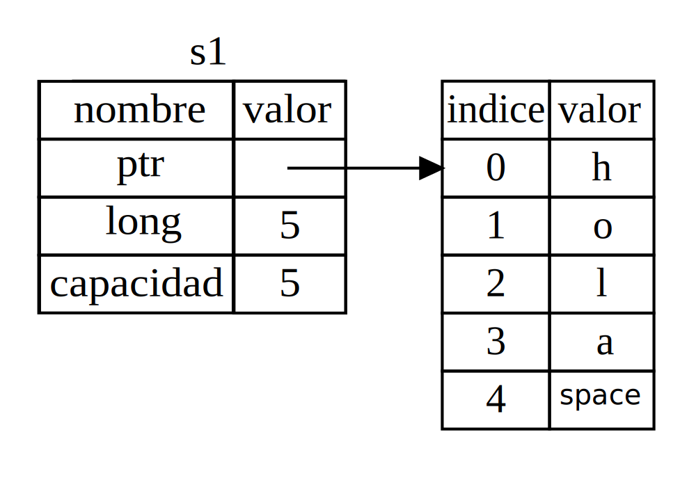
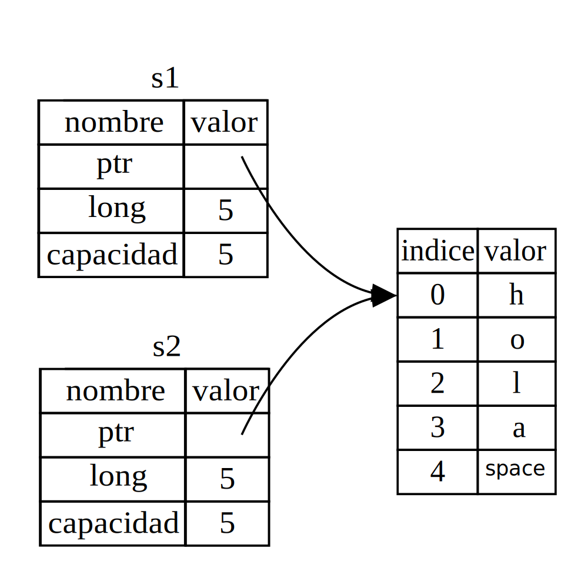
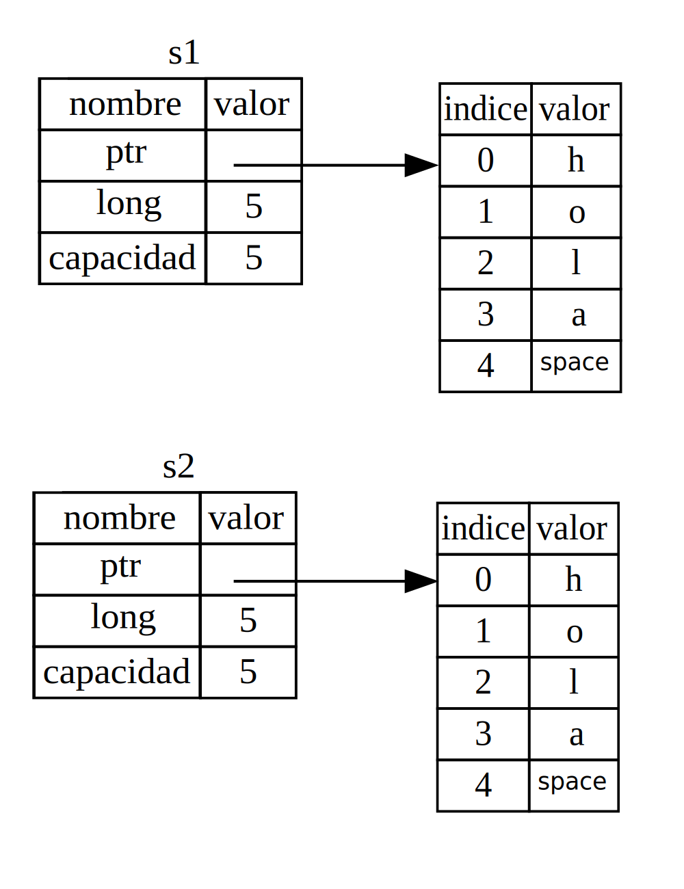
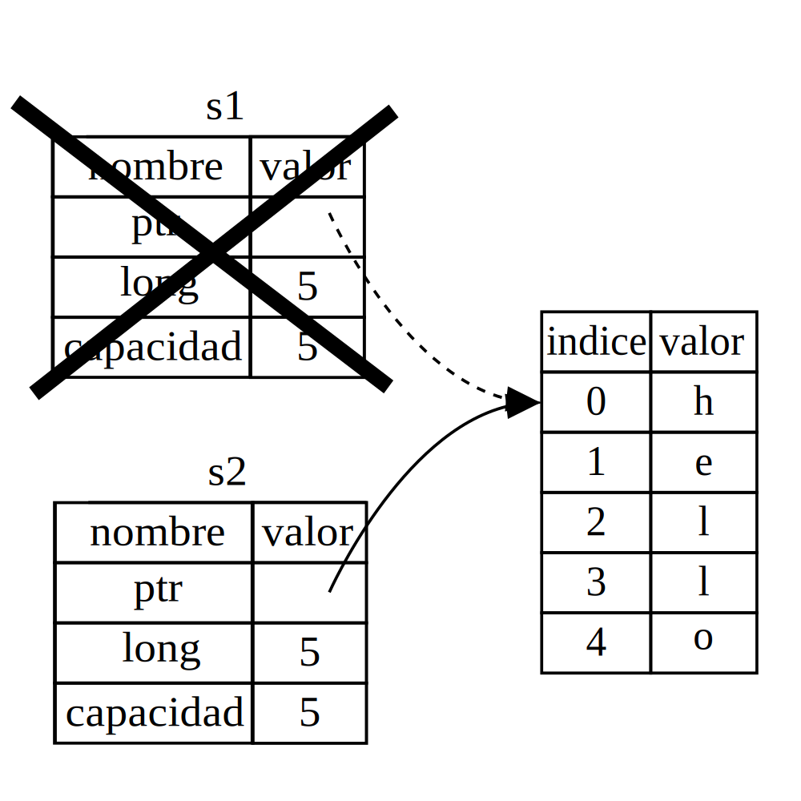

## ¿Qué es la Propiedad?

La característica central de Rust es la *propiedad*. Aunque la función es sencilla
de explicar, tiene profundas implicaciones para el resto del lenguaje.

Todos los programas deben administrar la forma en que usan la memoria de una computadora mientras se ejecutan.
Algunos lenguajes tienen recolección de basura que busca constantemente memoria que ya no se usa
mientras se ejecuta el programa; en otros lenguajes, el programador debe explícitamente
asignar y liberar la memoria. Rust usa un tercer enfoque: la memoria se administra
a través de un sistema de propiedad con un conjunto de reglas que el compilador comprueba en
tiempo de compilación. Ninguna de las funciones de propiedad ralentiza su programa mientras está
corriendo.

Dado que la propiedad es un concepto nuevo para muchos programadores, lleva algún tiempo
acostumbrarse a el. La buena noticia es que cuanto más experiencia tengas con Rust
y las reglas del sistema de propiedad, más podrá 
desarrollar naturalmente código que sea seguro y eficiente.

Cuando comprenda la propiedad, tendrá una base sólida para comprender
las características que hacen que Rust sea único. En este capítulo, aprenderá sobre propiedad
trabajando con algunos ejemplos que se centran en una estructura de datos muy común: cadenas.

> ### La Pila y el Monton
>
> En muchos lenguajes de programación, no es necesario pensar en la pila y
> el montón muy a menudo. Pero en un lenguaje de programación de sistemas como Rust, el que
> un valor esté en la pila o en el montón tiene más efecto sobre cómo el lenguaje
> se comporta y por qué tiene que tomar determinadas decisiones. Partes de la propiedad
> se describiran en relación con la pila y el montón más adelante en este capítulo, por lo que
> preparemos aquí una breve explicación.
>
> Tanto la pila como el montón son partes de la memoria que están disponibles para ser usadas por su
> código en tiempo de ejecución, pero están estructurados de diferentes maneras. La pila
> almacena valores en el orden en que los obtiene y elimina los valores en el
> orden opuesto. Esto se conoce como FIFO *último en entrar, primero en salir*. Piense en una pila
> de platos: cuando añades más platos, los colocas encima de la pila y
> cuando necesitas un plato, quitas uno de la parte superior. Agregar o quitar platos
> ¡desde el medio o desde abajo no funcionaría tan bien! Agregar datos se llama
> *pushing en la pila *, y eliminar datos se llama * popping de la pila *.
>
> Todos los datos almacenados en la pila deben tener un tamaño fijo conocido. Datos con un
> un tamaño desconocido en el momento de la compilación o un tamaño que pueda cambiar debe almacenarse en
> el montón en su lugar. El montón está menos organizado: cuando pones datos en el montón,
> solicitas una cierta cantidad de espacio. El asignador de memoria encuentra un lugar vacío
> en el montón que es lo suficientemente grande, lo marca como en uso y devuelve un
> *puntero*, que es la dirección de esa ubicación. Este proceso se llama
> *asignacion en el montón* y a veces se abrevia simplemente como *asignación*.
> Insertar valores en la pila no se considera asignación. Ya que
> el puntero es de un tamaño fijo conocido, puede almacenar el puntero en la pila, pero
> cuando desee los datos reales, debe seguir el puntero.
>
> Piense que está sentado en un restaurante. Cuando entró, indicó el número de
> personas en su grupo, y el personal encuentró una mesa vacía que se adapta a todos
> y te lleva a ella. Si alguien de su grupo llega tarde, puede preguntar dónde
> te has sentado para encontrarte.
>
> Empujar a la pila es más rápido que asignar en el montón porque el
> el asignador nunca tiene que buscar un lugar para almacenar nuevos datos;
> la ubicación siempre está en la parte superior de la pila. Comparativamente, asignando espacio
> en el montón requiere más trabajo, porque el asignador primero debe encontrar
> un espacio lo suficientemente grande para guardar los datos y luego realizar la contabilidad para preparar
> para la próxima asignación.
>
> Acceder a los datos del montón es más lento que acceder a los datos de la pila porque
> tienes que seguir un puntero para llegar allí. Los procesadores contemporáneos son más rápidos
> si saltan menos en la memoria. Continuando con la analogía, considere un camarero
> en un restaurante tomando pedidos de muchas mesas. Es más eficaz conseguir
> todos los pedidos en una mesa antes de pasar a la siguiente mesa. Tomando un
> pedido de la mesa A, luego un pedido de la mesa B, luego uno de A nuevamente, y
> otra vez uno de B sería un proceso mucho más lento. Del mismo modo, un
> procesador puede hacer mejor su trabajo si trabaja con datos cercanos a otros
> datos (ya que están en la pila) en lugar de más lejos (como puede ser el
> montón). La asignación de una gran cantidad de espacio en el montón también puede llevar tiempo.
>
> Cuando su código llama a una función, los valores pasados ​​a la función
> (incluyendo, potencialmente, punteros a datos en el montón) y 
> las variables locales de la función se insertan en la pila. Cuando la función termina, esos
> valores salen de la pila.
>
> Hacer un seguimiento de qué partes del código están usando qué datos en el montón,
> minimizar la cantidad de datos duplicados en el montón y limpiar los no utilizados
> para que no te quedes sin espacio son todos problemas sobre los que trata la propiedad.
> Una vez comprenda la propiedad, no tendrá que pensar en la
> pila y el montón muy a menudo, pero saber que la gestión de los datos del montón es la razón
> de que la propiedad exista puede ayudar a explicar por qué funciona de la manera en que lo hace.

### Reglas de Propiedad

Primero, echemos un vistazo a las reglas de propiedad. Tenga en cuenta estas reglas mientras
trabajar con los ejemplos que las ilustran:

* Cada valor en Rust tiene una variable que se llama su *propietario*.
* Solo puede haber un propietario a la vez.
* Cuando el propietario sale del alcance, el valor se eliminará.

### Alcance de Variable

Ya analizamos un ejemplo de un programa Rust en el Capítulo 2. Ahora
que hemos superado la sintaxis básica, no incluiremos todo el código `fn main() {` en los
ejemplos, por lo que tendrá que poner los siguientes
ejemplos dentro de una función `main` manualmente. Como resultado, nuestros ejemplos serán un
un poco más concisos, lo que nos permite centrarnos en los detalles reales en lugar de tener
código repetitivo.

Como primer ejemplo de propiedad, veremos el *alcance* de algunas variables. El
alcance es el rango dentro de un programa para el que un elemento es válido. Digamos que
tenemos una variable que se parece a esto:

```rust
let s = "hello";
```

La variable `s` se refiere a un literal de cadena, donde el valor de la cadena es
codificado en el texto de nuestro programa. La variable es válida desde el punto en
que se declara hasta el final del *alcance* actual. El Listado 4-1 tiene
comentarios que anotan dónde la variable `s` es válida.

```rust
{{#rustdoc_include ../listings/ch04-understanding-ownership/listing-04-01/src/main.rs:here}}
```

<span class="caption">Listado 4-1: Una variable y el alcance en el que se encuentra
válida</span>

En otras palabras, hay dos momentos importantes en el tiempo:

* Cuando `s` entra *en el alcance*, es válido.
* Sigue siendo válido hasta que se *sale del alcance*.

En este punto, la relación entre los alcances y cuándo las variables son válidas es
similar al de otros lenguajes de programación. Ahora construiremos sobre esta idea
introduciendo el tipo `String`.

### El Tipo `String`

Para ilustrar las reglas de propiedad, necesitamos un tipo de datos que sea más complejo.
que los que cubrimos en la sección ["Tipos de datos"][data-types]<!-- ignore -->
del Capítulo 3. Los tipos cubiertos anteriormente se almacenan en la pila
y salen de la pila cuando se termina su alcance, pero queremos ver los datos
que está almacenado en el montón y explorar cómo Rust sabe cuándo limpiar esos
datos.

Usaremos `String` como ejemplo aquí y nos concentraremos en las partes de `String`
que se relacionan con la propiedad. Estos aspectos también se aplican a otros tipos de datos complejos,
ya sean proporcionados por la biblioteca estándar o creados por usted.
Discutiremos `String` con más profundidad en el Capítulo 8.

Ya hemos visto cadenas de caracteres literales, donde un valor de cadena está codificado en nuestro
programa. Los literales de cadena son convenientes, pero no son adecuados para todas las
situaciónes en la que es posible que deseemos utilizar texto. Una de las razones es que son
inmutables. Otra es que no se pueden conocer todos los valores de cadena cuando escribimos
nuestro código: por ejemplo, ¿qué pasa si queremos tomar la entrada del usuario y almacenarla? Para
En estas situaciones, Rust tiene un segundo tipo de cadena, `String`. Este tipo es
asignado en el montón y, como tal, puede almacenar una cantidad de texto que es
desconocido para nosotros en el momento de la compilación. Puede crear una `String` a partir de un literal de cadena
usando la función `from`, así:

```rust
let s = String::from("hello");
```

Los dos puntos dobles (`::`) es un operador que nos permite asignar un espacio de nombres a este
función `from` en particular bajo el tipo` String` en lugar de usar algún tipo
de nombre como `string_from`. Discutiremos esta sintaxis en la sección ["Sintaxis de Métodos
”][method-syntax]<!-- ignore --> del Capítulo 5 y cuando hablemos
sobre el espacio de nombres con módulos en ["Rutas para hacer referencia a un elemento en el
Árbol de módulos”][paths-module-tree]<!-- ignore --> en el Capítulo 7.

Este tipo de cadena *se puede* mutar:

```rust
{{#rustdoc_include ../listings/ch04-understanding-ownership/no-listing-01-can-mutate-string/src/main.rs:here}}
```

Entonces, ¿cuál es la diferencia? ¿Por qué se puede mutar `String` pero no literales?
La diferencia es cómo tratan la memoria estos dos tipos.

### Memoria y Asignación

En el caso de un literal de cadena, conocemos el contenido en tiempo de compilación, por lo que
el texto está codificado directamente en el ejecutable final. Esta es la razón por la que las cadenas
literales son rápidas y eficientes. Pero estas propiedades solo provienen de la inmutabilidad
de la cadena literal. Desafortunadamente, no podemos preveer memoria en el
binario para cada fragmento de texto cuyo tamaño se desconoce en el momento de la compilación y cuyo
tamaño puede cambiar mientras se ejecuta el programa.

Con el tipo `String`, para admitir un fragmento de texto mutable y ampliable,
necesitamos asignar una cantidad de memoria en el montón, desconocida en el momento de la compilación,
para el contenido. Esto significa:

* La memoria debe solicitarse al asignador de memoria en tiempo de ejecución.
* Necesitamos una forma de devolver esta memoria al asignador cuando hallamos
  hecho el trabajo con nuestro `String`.

Esa primera parte la hacemos nosotros: cuando llamamos a `String::from`, su implementación
solicita la memoria que necesita. Esto es bastante universal en lenguajes de programación.

Sin embargo, la segunda parte es diferente. En lenguajes con *recolector de basura
(GC)*, el GC realiza un seguimiento y limpia la memoria que ya no se utiliza,
y no necesitamos pensar en ello. Sin un GC, es nuestra responsabilidad
identificar cuándo ya no se usa la memoria y llamar al código para devolverla explícitamente
como lo hicimos cuando la solicitamos. Hacer esto correctamente ha sido históricamente un
problema de programación difícil. Si lo olvidamos, desperdiciaremos la memoria. Si lo hacemos
demasiado pronto, tendremos una variable no válida. Si lo hacemos dos veces, eso también es un error.
Necesitamos emparejar exactamente una "asignación" con exactamente una "liberacion".

Rust toma un camino diferente: la memoria se devuelve automáticamente una vez que
la variable que la posee queda fuera de alcance. Aquí hay una versión de nuestro ejemplo de alcance.
del Listado 4-1 usando una `String` en lugar de una cadena literal:

```rust
{{#rustdoc_include ../listings/ch04-understanding-ownership/no-listing-02-string-scope/src/main.rs:here}}
```

Hay un punto natural en el que podemos devolver la memoria que requirio nuestra `String`
al asignador: cuando `s` sale del alcance. Cuando una variable sale del
alcance, Rust llama a una función especial por nosotros. Esta función se llama [`drop`],
y es donde el autor de "String" puede poner el código para devolver la memoria.
Rust llama `drop` automáticamente en el corchete de cierre.

> Nota: En C ++, este patrón de desasignación de recursos al final de la vida útil un elemento
> a veces se denomina *Resource Acquisition Is Initialization (RAII)*.
> La función `drop` en Rust le resultará familiar si ha utilizado patrones RAII.

Este patrón tiene un impacto profundo en la forma en que se escribe el código de Rust. Puede parecer
simple en este momento, pero el comportamiento del código puede ser inesperado en
situaciones más complicadas, en las que queremos que varias variables utilicen los datos
que hemos asignado en el montón. Exploremos algunas de esas situaciones ahora.

#### Maneras en que las Variables y los Datos Interactúan: Move

Varias variables pueden interactuar con los mismos datos de diferentes formas en Rust.
Veamos un ejemplo usando un número entero en el Listado 4-2.

```rust
{{#rustdoc_include ../listings/ch04-understanding-ownership/listing-04-02/src/main.rs:here}}
```

<span class="caption">Listado 4-2: Asignación del valor entero de la variable `x`
a `y`</span>

Probablemente podamos adivinar lo que está haciendo esto: “unir el valor `5` a `x`; entonces hacer
una copia del valor en `x` y vincularlo a `y`." Ahora tenemos dos variables, `x`
e `y`, y ambos son iguales a `5`. De hecho, esto es lo que está sucediendo, porque los números enteros
son valores simples con un tamaño fijo conocido, y estos dos valores `5` se insertan
en la pila.

Ahora veamos la versión `String`:

```rust
{{#rustdoc_include ../listings/ch04-understanding-ownership/no-listing-03-string-move/src/main.rs:here}}
```

Esto se ve muy similar al código anterior, por lo que podríamos suponer que la forma
en que funciona sería la misma: es decir, la segunda línea haría una copia del
valor en `s1` y la vincularia a `s2`. Pero esto no es exactamente lo que sucede.

Eche un vistazo a la Figura 4-1 para ver lo que le está sucediendo a `String` bajo el
capó. Una `String` se compone de tres partes, que se muestran a la izquierda: un puntero a
la memoria que contiene el contenido de la cadena, una longitud y una capacidad.
Este grupo de datos se almacena en la pila. A la derecha está la memoria en el
montón, con el contenido.



<span class="caption">Figura 4-1: Representación en la memoria de una `String`
manteniendo el valor `"hello"` vinculado a `s1`</span>

La longitud es la cantidad de memoria, en bytes, que tiene el contenido de la `String`
actualmente usando. La capacidad es la cantidad total de memoria, en bytes, que la
`String` ha recibido del asignador. La diferencia entre longitud
y la capacidad importa, pero no en este contexto, por lo que, por ahora, ignoraremos
la capacidad.

Cuando asignamos `s1` a `s2`, los datos de `String` se copian, lo que significa que copiamos el
puntero, la longitud y la capacidad que hay en la pila. No copiamos los
datos en el montón al que hace referencia el puntero. En otras palabras,
la representación de los datos en la memoria se parece a la Figura 4-2.



<span class="caption">Figura 4-2: Representación en memoria de la variable `s2`
que tiene una copia del puntero, la longitud y la capacidad de `s1`</span>

La representación *no* se parece a la Figura 4-3, que es lo que la memoria
pareceria si Rust también copiara los datos del montón. Si Rust hizo esto,
la operación `s2 = s1` podría ser muy costosa en términos de rendimiento en tiempo de ejecución si
los datos del montón eran grandes.



<span class="caption">Figura 4-3: Otra posibilidad de lo que `s2 = s1` podría
hacer si Rust también copió los datos del montón</span>

Anteriormente, dijimos que cuando una variable sale del alcance, Rust automáticamente
llama a la función `drop` y limpia la memoria del montón para esa variable. Pero
la Figura 4-2 muestra ambos punteros de datos apuntando a la misma ubicación. Esto es un
problema: cuando `s2` y `s1` salen del alcance, ambos intentarán liberar la
misma memoria. Esto se conoce como un error *double free* y es uno de los
errores de seguridad que mencionamos anteriormente. Liberar memoria dos veces puede conducir a
corrupción de memoria, que potencialmente puede conducir a vulnerabilidades de seguridad.

Para garantizar la seguridad de la memoria, hay un detalle más de lo que sucede en este
situación en Rust. En lugar de intentar copiar la memoria asignada, Rust
considera que `s1` ya no es válido y, por lo tanto, Rust no necesita liberar
cualquier cosa cuando `s1` salga del alcance. Mira lo que sucede cuando intentas
usar `s1` después de crear` s2`; no funcionará:

```rust,ignore,does_not_compile
{{#rustdoc_include ../listings/ch04-understanding-ownership/no-listing-04-cant-use-after-move/src/main.rs:here}}
```

Obtendrá un error como este porque Rust le impide usar la
referencia invalidada:

```console
{{#include ../listings/ch04-understanding-ownership/no-listing-04-cant-use-after-move/output.txt}}
```

Si escuchó los términos *copia superficial* y *copia profunda* mientras trabajaba con
otros idiomas, el concepto de copiar el puntero, la longitud y la capacidad
sin copiar los datos probablemente suene como hacer una copia superficial. Pero
ya que Rust también invalida la primera variable, en lugar de llamarse
copia superficial, se conoce como *move*. En este ejemplo, diríamos que
`s1` se *movió* a `s2`. Lo que realmente sucede se muestra en la Figura 4-4.



<span class="caption">Figura 4-4: Representación en la memoria después de que `s1` haya sido
invalidado</span>

¡Eso resuelve nuestro problema! Con solo `s2` válido, cuando sale del alcance,
solo liberará la memoria, y hemos terminado.

Además, hay una opción de diseño que está implícita en esto: Rust nunca
crea automáticamente copias "profundas" de sus datos. Por lo tanto, cualquier copia *automática*
se puede suponer económica en términos de rendimiento en tiempo de ejecución.

#### Maneras en que las Variables y los Datos Interactúan: Clone

Si *queremos* copiar profundamente los datos del montón de la `String`, no solo los
datos de la pila, podemos usar un método común llamado `clone`. Discutiremos su
sintaxis en el Capítulo 5, pero debido a que los métodos son una característica común en muchos
lenguajes de programación, probablemente los hayas visto antes.

A continuación, se muestra un ejemplo del método `clone` en acción:


```rust
{{#rustdoc_include ../listings/ch04-understanding-ownership/no-listing-05-clone/src/main.rs:here}}
```

Esto funciona bien y produce explícitamente el comportamiento que se muestra en la Figura 4-3,
donde los datos del montón *sí* se copian.

Cuando vea una llamada a `clone`, sabrá que se está ejecutando un código arbitrario
y ese código puede ser costoso. Es un indicador visual de que algo
diferente está sucediendo.

#### Datos solo en Pila: Copy

Hay otro asunto del que aún no hemos hablado. Este código usando números enteros -
parte del cual se mostró en el Listado 4-2 - funciona y es válido:

```rust
{{#rustdoc_include ../listings/ch04-understanding-ownership/no-listing-06-copy/src/main.rs:here}}
```

Pero este código parece contradecir lo que acabamos de aprender: no tenemos una llamada a
`clone`, pero `x` sigue siendo válido y no se movió a `y`.

La razón es que tipos como los enteros que tienen un tamaño conocido en la compilación
se almacena completamente en la pila, por lo que las copias de los valores reales son rápidas
de hacer. Eso significa que no hay ninguna razón por la que queramos evitar que `x` sea
válido después de que creamos la variable `y`. En otras palabras, no hay diferencia
entre copia profunda y superficial aquí, por lo que llamar a `clone` no haría nada
diferente de la copia superficial habitual y podemos omitirlo.

Rust tiene una anotación especial llamada el trait `Copy` que podemos colocar en
tipos como enteros que se almacenan en la pila (hablaremos más sobre traits
en el Capítulo 10). Si un tipo implementa el trait `Copy`, una variable más antigua es
todavía utilizable después de la asignación. Rust no nos deja anotar un tipo con el trait
`Copy` si el tipo, o cualquiera de sus partes, ha implementado el trait `Drop`.
Si el tipo necesita que suceda algo especial cuando el valor sale del
alcance y agregamos la anotación `Copy` a ese tipo, obtendremos un error en tiempo de compilación.
Para aprender cómo agregar la anotación `Copy` a su tipo para
implementar el trait, consulte ["traits derivables"][derivable-traits]<!-- ignore -->
en el Apéndice C.

Entonces, ¿qué tipos implementan el trait `Copy`? Puede consultar la documentación para
el tipo dado para estar seguro, pero como regla general, cualquier grupo de valores escalares simples
pueden implementar `Copy`, y nada que requiera asignación o sea alguna
forma de recurso puede implementar `Copy`. Éstos son algunos de los tipos que
implementan `Copy`:

* Todos los tipos de enteros, como `u32`.
* El tipo booleano, `bool`, con valores `verdadero` y `falso`.
* Todos los tipos de coma flotante, como `f64`.
* El tipo de carácter, `char`.
* Tuplas, si solo contienen tipos que también implementan `Copy`. Por ejemplo,
  `(i32, i32)` implementa `Copy`, pero `(i32, String)` no.

### Propiedad y Funciones

La semántica para pasar un valor a una función es similar a la de
asignar un valor a una variable. Pasar una variable a una función moverá o
copiará, tal como lo hace la asignación. El Listado 4-3 tiene un ejemplo con algunas anotaciones
mostrando dónde entran y salen las variables del alcance.

<span class="filename"> ​Nombre de archivo: src/main.rs</span>

```rust
{{#rustdoc_include ../listings/ch04-understanding-ownership/listing-04-03/src/main.rs}}
```

<span class="caption">Listado 4-3: Funciones con propiedad y alcance
anotado</span>

Si intentáramos usar `s` después de la llamada a `takes_ownership`, Rust arrojaría un
error en tiempo de compilación. Estos controles estáticos nos protegen de errores. Intenta agregar
código a `main` que usa `s` y `x` para ver dónde puede usarlos y dónde
las reglas de propiedad le impiden hacerlo.

### Valores Devueltos y Alcance

Los valores devueltos también pueden transferir la propiedad. El Listado 4-4 es un ejemplo con
anotaciones similares a las del Listado 4-3.

<span class="caption">​​Nombre de archivo: src/main.rs</span>

```rust
{{#rustdoc_include ../listings/ch04-understanding-ownership/listing-04-04/src/main.rs}}
```

<span class="caption">Listado 4-4: Transferencia de la propiedad de 
valores de retorno</span>

La propiedad de una variable sigue el mismo patrón cada vez: asignar un
valor a otra variable lo mueve. Cuando una variable que incluye datos en el
montón sale del alcance, el valor se limpiará con `drop` a menos que los datos
se han movido para ser propiedad de otra variable.

Tomar propiedad y luego devolverla con cada función es un poco
tedioso. ¿Qué pasa si queremos permitir que una función use un valor pero no se lo apropie?
Es bastante molesto que cualquier cosa que pasemos también deba devolverse si
desea utilizarla de nuevo, además de cualquier dato resultante del cuerpo de la
función que también podríamos querer devolver.

Es posible devolver múltiples valores usando una tupla, como se muestra en el Listado 4-5.

<span class="filename">​​Nombre de archivo: src/main.rs</span>

```rust
{{#rustdoc_include ../listings/ch04-understanding-ownership/listing-04-05/src/main.rs}}
```

<span class="caption">Listado 4-5: Devolución de la propiedad de los parámetros</span>

Pero esto es demasiada ceremonia y mucho trabajo para un concepto que debería ser
común. Afortunadamente para nosotros, Rust tiene una función para este concepto, llamada
*referencias*.

[data-types]: ch03-02-data-types.html#Tipos de Datos
[derivable-traits]: appendix-03-derivable-traits.html
[method-syntax]: ch05-03-method-syntax.html#method-syntax
[paths-module-tree]: ch07-03-paths-for-referring-to-an-item-in-the-module-tree.html
[`drop`]: https://doc.rust-lang.org/std/ops/trait.Drop.html#tymethod.drop

