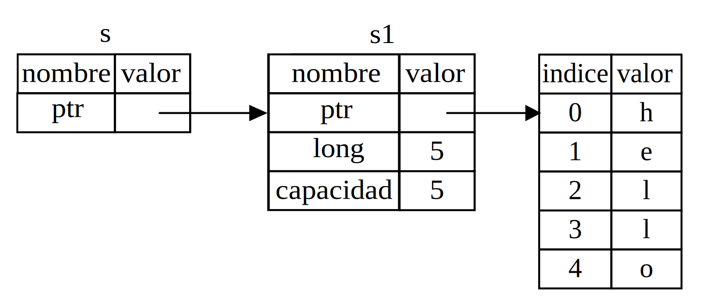

## Referencias y Prestamos

El problema con el código con la tupla (s2, len) en el Listado 4-5 es que tenemos que devolver el
`String` a la función de llamada de forma que todavía podamos usarlo después de
llamar a `calculate_length`, porque el `String` se movió a `calculate_length`.

Así es como se definiría y usaría una función `calculate_length` que tiene una
referencia a un objeto como parámetro en lugar de tomar posesión del valor:

<span class="filename">​​Nombre de archivo: src/main.rs</span>

```rust
{{#rustdoc_include ../listings/ch04-understanding-ownership/no-listing-07-reference/src/main.rs:all}}
```

Primero, observe que todo el código de tupla en la declaración de variable y
el valor de retorno de la función se ha eliminado. En segundo lugar, tenga en cuenta que pasamos `&s1` a
`calculate_length` y, en su definición, tomamos `&String` en lugar de `String`.

Estos símbolos `&` son *referencias* y le permiten hacer referencia a algún valor
sin apropiarse de ellos. La figura 4-5 muestra un diagrama.



<span class="caption">Figura 4-5: Un diagrama de `&String s` apuntando a `String s1`</span>

> Nota: Lo opuesto a hacer referencia usando `&` es *desreferenciar*, que se
> logra con el operador de desreferencia, `*`. Veremos algunos usos del
> operador de desreferencia en el Capítulo 8 y discutiremos los detalles de desreferenciación en
> Capítulo 15.

Echemos un vistazo más de cerca a la llamada a la función:

```rust
{{#rustdoc_include ../listings/ch04-understanding-ownership/no-listing-07-reference/src/main.rs:here}}
```

La sintaxis `&s1` nos permite crear una referencia que *se refiere* al valor de `s1`
pero no lo posee. Debido a que no lo posee, el valor al que apunta no será
descartado cuando la referencia quede fuera del alcance.

Asimismo, la función utiliza `&` para indicar que el tipo del
parámetro `s` es una referencia. Agreguemos algunas anotaciones explicativas:

```rust
{{#rustdoc_include ../listings/ch04-understanding-ownership/no-listing-08-reference-with-annotations/src/main.rs:here}}
```

El alcance en el que la variable `s` es válida es el mismo que el alcance del parámetro 
de cualquier función, pero cuando queda fuera de alcance, no se descarta a lo qué apunta la referencia 
porque la funcion no tiene la propiedad. Cuando las funciones tienen referencias como
parámetros, en lugar de los valores reales, no necesitaremos devolver los valores
para devolver la propiedad, porque nunca tuvimos la propiedad.

Llamamos *tomar prestado (borrowing)*, a tener referencias como parámetros de función. Como en la vida real, 
si una persona posee algo, se lo puede pedir prestado. Cuando haya terminado, tiene que devolverlo.

Entonces, ¿qué sucede si intentamos modificar algo que estamos pidiendo prestado? Pruebe el código en
Listado 4-6. Avisamos: ¡no funciona!

<span class="filename">​​Nombre de archivo: src/main.rs</span>

```rust,ignore,does_not_compile
{{#rustdoc_include ../listings/ch04-understanding-ownership/listing-04-06/src/main.rs}}
```

<span class="caption">Listado 4-6: Intento de modificar un valor prestado</span>

Aquí está el error:

```console
{{#include ../listings/ch04-understanding-ownership/listing-04-06/output.txt}}
```

Así como las variables son inmutables por defecto, también lo son las referencias. No está
permitido modificar algo prestado, de lo que solo tenemos una referencia.

### Referencias Mutables

Podemos corregir el error en el código del Listado 4-6 con solo un pequeño ajuste:

<span class="filename">​​Nombre de archivo: src/main.rs</span>

```rust
{{#rustdoc_include ../listings/ch04-understanding-ownership/no-listing-09-fixes-listing-04-06/src/main.rs}}
```

Primero, cambiamos `s` para que sea `mut`. Despues creamos una
referencia mutable con `&mut s` y aceptamos una referencia mutable con `some_string: &mut String`.

Pero las referencias mutables tienen una gran restricción: para un dato particular,
solo se puede tener UNA referencia en UN ámbito particular. Este código fallará:

<span class="filename">​​Nombre de archivo: src/main.rs</span>

```rust,ignore,does_not_compile
{{#rustdoc_include ../listings/ch04-understanding-ownership/no-listing-10-multiple-mut-not-allowed/src/main.rs:here}}
```

Aquí está el error:

```console
{{#include ../listings/ch04-understanding-ownership/no-listing-10-multiple-mut-not-allowed/output.txt}}
```

Esta restricción permite la mutación pero de una manera muy controlada. Es
algo con lo que los nuevos rustáceos luchan, porque la mayoría de los lenguajes le permiten
mutar cuando quiera.

El beneficio de tener esta restricción es que Rust puede evitar carreras de datos en
tiempo de compilación. Una *carrera de datos* es similar a una condición de carrera y ocurre cuando
se dan estos tres comportamientos:

* Dos o más punteros acceden a los mismos datos al mismo tiempo.
* Se está utilizando al menos uno de los punteros para escribir en los datos.
* No se está utilizando ningún mecanismo para sincronizar el acceso a los datos.

Las carreras de datos provocan un comportamiento indefinido y pueden ser difíciles de diagnosticar y corregir
cuando se intenta localizarlos en tiempo de ejecución; Rust previene este problema
porque ni siquiera compila código con carreras de datos.

Como siempre, podemos usar llaves para crear un nuevo alcance, lo que permite
múltiples referencias mutables, pero *no simultáneas*:

```rust
{{#rustdoc_include ../listings/ch04-understanding-ownership/no-listing-11-muts-in-separate-scopes/src/main.rs:here}}
```

Existe una regla similar para combinar referencias mutables e inmutables. Este codigo
da como resultado un error:

```rust,ignore,does_not_compile
{{#rustdoc_include ../listings/ch04-understanding-ownership/no-listing-12-immutable-and-mutable-not-allowed/src/main.rs:here}}
```

Aquí está el error:

```console
{{#include ../listings/ch04-understanding-ownership/no-listing-12-immutable-and-mutable-not-allowed/output.txt}}
```

¡Uf! *tampoco* podemos tener una referencia mutable mientras tengamos una inmutable.
Los usuarios de una referencia inmutable no esperan que los valores cambien repentinamente
en ningun sitio! Sin embargo, varias referencias inmutables están bien porque nadie
que solo está leyendo los datos tiene la capacidad de afectar la lectura de cualquier otro.

Tenga en cuenta que el alcance de una referencia comienza desde donde se introduce y continúa
hasta la última vez que se utilizó esa referencia. Por ejemplo, este código
compila porque el último uso de las referencias inmutables ocurre antes de la
introduccion de una referencia mutable:

```rust,edition2018
{{#rustdoc_include ../listings/ch04-understanding-ownership/no-listing-13-reference-scope-ends/src/main.rs:here}}
```

Los alcances de las referencias inmutables `r1` y `r2` terminan después de `println!`
donde se usaron por última vez, que es antes de la creacion de la referencia mutable `r3`.
Estos alcances no se superponen, por lo que este código está permitido.

Aunque los errores de préstamo pueden resultar frustrantes en ocasiones, recuerde que es
el compilador de Rust quien señala un error potencial temprano (en tiempo de compilación en lugar de
en tiempo de ejecución) y muestra exactamente dónde está el problema. Por tanto, no
tiene que averiguar por qué sus datos no son los que pensaba.

### Referencias Colgantes (Dangling)

En los lenguajes con punteros es fácil crear erróneamente un *puntero colgante*; 
un puntero que hace referencia a una ubicación en la memoria que puede haber sido
dada a otro, liberando algo de memoria, mientras se conserva un puntero
a esa memoria. En Rust, por el contrario, el compilador garantiza que las referencias
nunca serán referencias colgantes; si tiene una referencia a algunos datos, el
compilador se asegurará de que los datos no salgan del alcance antes de que
la referencia a los datos lo haga.

Intentemos crear una referencia colgante, que Rust evitará con un
error en tiempo de compilación:

<span class="filename">​​Nombre de archivo: src/main.rs</span>

```rust,ignore,does_not_compile
{{#rustdoc_include ../listings/ch04-understanding-ownership/no-listing-14-dangling-reference/src/main.rs}}
```

Aquí está el error:

```console
{{#include ../listings/ch04-understanding-ownership/no-listing-14-dangling-reference/output.txt}}
```

Este mensaje de error hace referencia a una caracteristica que aún no hemos cubierto: la vida útil.
Discutiremos la vida útil en detalle en el Capítulo 10. Pero, si ignora las partes
sobre vidas, el mensaje contiene la clave de por qué este código es un problema:

```text
this function's return type contains a borrowed value, but there is no value
for it to be borrowed from.
```

Echemos un vistazo más de cerca a lo que está sucediendo exactamente en cada etapa de nuestro
código `dangle`:

<span class="filename">​​Nombre de archivo: src/main.rs</span>

```rust,ignore,does_not_compile
{{#rustdoc_include ../listings/ch04-understanding-ownership/no-listing-15-dangling-reference-annotated/src/main.rs:here}}
```

Debido a que `s` se crea dentro de `dangle`, cuando el código de `dangle` finaliza,
`s` se desasignará. Pero intentamos devolver una referencia. Eso significa que
esta referencia estaría apuntando a una `String` no válida. ¡Eso no es bueno! Rust
no nos dejará hacerlo.

La solución aquí es devolver el `String` directamente:

```rust
{{#rustdoc_include ../listings/ch04-understanding-ownership/no-listing-16-no-dangle/src/main.rs:here}}
```

Esto funciona sin problemas. La propiedad se traslada y nada se
desasigna.

### Las Reglas de las Referencias

Recapitulemos lo que hemos discutido sobre las referencias:

* En cualquier momento, puede tener *ya sea* una referencia mutable *o* cualquier
  número de referencias inmutables.
* Las referencias deben ser siempre válidas.

A continuación, veremos un tipo diferente de referencia: slices.

