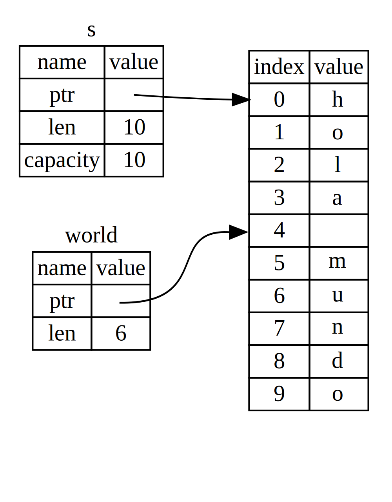

## El Tipo Slice

Otro tipo de datos que no tiene propiedad es el *slice*. Los Slices permiten
hacer referencia a una secuencia contigua de elementos en una colección, en lugar de 
a la colección completa.

Veamos un pequeño problema de programación: escribir una función que tome una cadena y
devuelva la primera palabra que encuentra en esa cadena. Si la función no encuentra un
espacio en la cadena, toda la cadena debe ser una palabra, por lo que debe ser devuelta toda la cadena.

Pensemos en la declaracion de esta función:

```rust,ignore
fn first_word(s: &String) -> ?
```

Esta función, `first_word`, tiene `&String` como parámetro. No queremos
propiedad, así que esto está bien. Pero, ¿qué debemos devolver? Realmente no tenemos una
manera de hablar sobre una *parte* de una cadena. Sin embargo, podríamos devolver el índice del
fin de la palabra. Intentémoslo, como se muestra en el Listado 4-7.

<span class="filename">Nombre de archivo: src/main.rs</span>

```rust
{{#rustdoc_include ../listings/ch04-understanding-ownership/listing-04-07/src/main.rs:here}}
```

<span class="caption">Listing 4-7: La función `first_word` que devuelve un
byte de índice en el parámetro `String`</span>

Puesto que tenemos que pasar por el `String` elemento por elemento y comprobar si
un valor es un espacio, convertiremos nuestra `String` en una matriz de bytes usando el
método `as_bytes`:

```rust,ignore
{{#rustdoc_include ../listings/ch04-understanding-ownership/listing-04-07/src/main.rs:as_bytes}}
```

A continuación, creamos un iterador sobre la matriz de bytes usando el método `iter`:

```rust,ignore
{{#rustdoc_include ../listings/ch04-understanding-ownership/listing-04-07/src/main.rs:iter}}
```

Discutiremos los iteradores con más detalle en el Capítulo 13. Por ahora, sepa que `iter`
es un método que devuelve cada elemento de una colección y que `enumerate`
envuelve el resultado de `iter` y, en su lugar, devuelve cada elemento como parte de una tupla.
El primer elemento de la tupla devuelto por `enumerate` es el índice y el
segundo elemento es una referencia al elemento. Esto es un poco más conveniente
que calcular el índice nosotros mismos.

Debido a que el método `enumerate` devuelve una tupla, podemos usar patrones para
desestructurar esa tupla, como en cualquier otro lugar de Rust. Entonces, en el 
bucle `for` especificamos un patrón que tiene `i` para el índice en la tupla y `&item`
para cada byte en la tupla. Puesto que obtenemos una referencia al elemento
desde `.iter().enumerate()`, usamos `&` en el patrón.

Dentro del bucle `for`, buscamos el byte que representa el espacio
utilizando la sintaxis literal de bytes. Si encontramos un espacio, devolvemos la posición.
De lo contrario, devolvemos la longitud de la cadena usando `s.len()`:

```rust,ignore
{{#rustdoc_include ../listings/ch04-understanding-ownership/listing-04-07/src/main.rs:inside_for}}
```

Ahora tenemos una forma de averiguar el índice del final de la primera palabra en la
cadena, pero hay un problema. Devolvemos un `usize` que, por sí solo, es
un número sólo significativo en el contexto de `&String`. En otras palabras,
debido a que es un valor separado de la `String`, no hay garantía de que
seguirá siendo válido en el futuro. Considere el programa del Listado 4-8 que
usa la función `first_word` del Listado 4-7.

<span class="filename">Nombre de archivo: src/main.rs</span>

```rust
{{#rustdoc_include ../listings/ch04-understanding-ownership/listing-04-08/src/main.rs:here}}
```

<span class="caption">Listado 4-8: Almacenamiento del resultado de llamar a la función `first_word` y 
luego cambiar el contenido de `String`</span>

Este programa se compila sin errores y también lo haría si usáramos `word`
después de llamar a `s.clear()`. Puesto que `word` no está conectada con el estado de `s`
en absoluto, `word` todavía contiene el valor `5`. Podríamos usar ese valor `5` con
la variable `s` para intentar extraer la primera palabra, pero esto sería un error
porque el contenido de `s` ha cambiado desde que guardamos `5` en `word`.

Tener que preocuparse de que el índice en `word` no esté sincronizado con los datos en
`s` es tedioso y propenso a errores. La gestión de estos índices es aún más frágil si
escribimos una función `second_word`. Su declaracion podría verse así:

```rust,ignore
fn second_word(s: &String) -> (usize, usize) {
```

Ahora estamos rastreando un índice inicial *y* uno final, y tenemos aún más
valores que se calcularon a partir de datos en un estado en particular, pero que no están vinculados a
ese estado en absoluto. Ahora tenemos tres variables no relacionadas flotando alrededor que
deben mantenerse sincronizadas.

Afortunadamente, Rust tiene una solución a este problema: slices de strings.

### Slices de String

Un *string slice* es una referencia a parte de una `String`, y se ve así:

```rust
{{#rustdoc_include ../listings/ch04-understanding-ownership/no-listing-17-slice/src/main.rs:here}}
```

Esto es similar a tomar una referencia a toda la `String` pero con el extra
`[0..5]`. En lugar de una referencia a toda la `String`, es una referencia
a una parte de la `String`.

Podemos crear slices usando un rango entre corchetes especificando
`[starting_index..ending_index]`, donde `starting_index` es la primera posición
en el segmento y `ending_index` es uno más que la última posición en la slice.
Internamente, la estructura de datos del slice almacena la posición inicial y
la longitud de la slice, que se corresponde `ending_index` menos
`starting_index`. Así que en el caso de `let world = &s[6..11];`, `world` sería
un segmento que contiene un puntero al séptimo byte (contando desde 1) de `s` con un valor de longitud de 5.

La Figura 4-6 muestra esto en un diagrama.



<span class="caption">Figura 4-6: Slice de cadena que hace referencia a parte de una
`String`</span>

Con la sintaxis de rango `..` de Rust, si desea comenzar en el primer índice (cero),
puede eliminar el valor antes de los dos puntos. En otras palabras, esto es equivalente:

```rust
let s = String::from("hello");

let slice = &s[0..2];
let slice = &s[..2];
```

Del mismo modo, si su slice incluye el último byte de la `String`,
puede eliminar el número final. Eso significa que esto es equivalente:

```rust
let s = String::from("hello");

let len = s.len();

let slice = &s[3..len];
let slice = &s[3..];
```

También puede eliminar ambos valores para tomar una slice de toda la cadena. Esto es equivalente:

```rust
let s = String::from("hello");

let len = s.len();

let slice = &s[0..len];
let slice = &s[..];
```

> Nota: Los índices de rango de slice de cadena deben ocurrir en fronteras de carácter UTF-8 válido.
> Si intenta crear un slice en medio de un carácter multibyte, su programa se cerrará con un error.
> Con el fin de introducir slices de cadena, asumimos ASCII solo en esta sección; una
> discusión más detallada sobre el manejo de UTF-8 se encuentra en la sección ["Almacenando Texto Codificado UTF-8 con strings”][strings]<!-- ignore --> del Capítulo 8.

Con toda esta información en mente, reescribamos `first_word` para devolver una
slice. El tipo que significa "string slice" se escribe como `&str`:

<span class="filename">Nombre de archivo: src/main.rs</span>

```rust
{{#rustdoc_include ../listings/ch04-understanding-ownership/no-listing-18-first-word-slice/src/main.rs:here}}
```

Obtenemos el índice para el final de la palabra de la misma manera que lo hicimos en el Listado
4-7, buscando la primera aparición de un espacio. Cuando encontramos un espacio,
devolvemos un slice de cadena usando el inicio de la cadena y el índice del espacio
como los índices inicial y final.

Ahora, cuando llamamos a `first_word`, obtenemos un valor único que está vinculado a los
datos subyacentes. El valor se compone de una referencia al punto de partida del
slice y el número de elementos en el.

Devolver un segmento también funcionaría para una función `second_word`:

```rust,ignore
fn second_word(s: &String) -> &str {
```

Ahora tenemos una API sencilla que es mucho más difícil de estropear, porque el
compilador se asegurará de que las referencias a la `String` sigan siendo válidas. ¿Recuerda
el error en el programa del Listado 4-8, cuando llevamos el índice al final de la
primera palabra pero luego borró la cadena, por lo que nuestro índice no era válido? Ese código fue
lógicamente incorrecto, pero no mostró ningún error inmediato. Los problemas
aparecer más tarde si seguimos intentando usar el índice de la primera palabra con una
cadena. Las slices hacen que este error sea imposible y nos hacen saber que tenemos un problema con
nuestro código mucho antes. El uso de la versión de slice de `first_word` arrojará un
error en tiempo de compilación:

<span class="filename">​​Nombre de archivo: src/main.rs</span>

```rust,ignore,does_not_compile
{{#rustdoc_include ../listings/ch04-understanding-ownership/no-listing-19-slice-error/src/main.rs:here}}
```

Este es el error del compilador:

```console
{{#include ../listings/ch04-understanding-ownership/no-listing-19-slice-error/output.txt}}
```

Recuerde de las reglas de préstamos que si tenemos una referencia inmutable a
algo, no podemos tomar también una referencia mutable. Ya que `clear` necesita
truncar el `String`, necesita obtener una referencia mutable. Rust no permite
esto, y la compilación falla. Rust no solo ha hecho que nuestra API sea más fácil de usar, sino que
¡también ha eliminado toda una clase de errores en tiempo de compilación!

#### Los Literales de Cadena son Slices

Recuerde que hablamos de que los literales de cadena se almacenan dentro del binario. Ahora
que conocemos sobre los slices, podemos entender correctamente los literales de cadena:

```rust
let s = "Hello, world!";
```

El tipo de `s` aquí es `&str`; es un slice que apunta a ese punto específico del
binario. Esta es también la razón por la que los literales de cadena son inmutables; `&str` es una
referencia inmutable.

#### String Slices como Parametros

Saber que puede tomar slices de literales y valores de `String` nos lleva a
una mejora más en `first_word`, y esta es su declaración:

```rust,ignore
fn first_word(s: &String) -> &str {
```

Un rustáceo más experimentado escribiría la declaración que se muestra en el Listado 4-9
en su lugar porque nos permite usar la misma función en ambos valores, `&String`
y `&str`.

```rust,ignore
{{#rustdoc_include ../listings/ch04-understanding-ownership/listing-04-09/src/main.rs:here}}
```

<span class="caption">Listado 4-9: Mejorando la función `first_word` usando
un slice de cadena para el tipo del parámetro `s`</span>

Si tenemos un slice de cadena, podemos pasarlo directamente. Si tenemos una `String`,
puede pasar una slice de toda la `String`. Definiendo una función para tomar un
slice en lugar de una referencia a una `String` hace que nuestra API sea más general y útil
sin perder ninguna funcionalidad:

<span class="filename">Nombre de archivo: src/main.rs</span>

```rust
{{#rustdoc_include ../listings/ch04-understanding-ownership/listing-04-09/src/main.rs:usage}}
```

### Otros Slices

Los slices de cadena, como puede imaginar, son específicos de las cadenas. Pero hay
también un tipo de slice más general. Considere esta matriz:

```rust
let a = [1, 2, 3, 4, 5];
```

Así como podríamos querer referirnos a una parte de una cadena, podríamos querer referirnos
a parte de una matriz. Lo haríamos así:

```rust
let a = [1, 2, 3, 4, 5];

let slice = &a[1..3];

assert_eq!(slice, &[2, 3]);
```

Este slice tiene el tipo `&[i32]`. Funciona de la misma manera que los string slices,
almacenando una referencia al primer elemento y una longitud. Usará este tipo de
slice para todo tipo de colecciones. Discutiremos estas colecciones en
detalle cuando hablamos de vectores en el Capítulo 8.

## Sumario

Los conceptos de propiedad, préstamo y slices garantizan la seguridad de la memoria en programas Rust
en tiempo de compilación. El lenguaje Rust le da control sobre su uso de memoria
de la misma manera que otros lenguajes de programación de sistemas, pero teniendo
la propiedad de los datos se limpian automáticamente esos datos cuando el propietario sale del alcance,
lo que significa que no tiene que escribir ni depurar código adicional para obtener este control.

La propiedad afecta el funcionamiento de muchas otras partes de Rust, por lo que hablaremos de
estos conceptos más adelante a lo largo del resto del libro. Vayamos al
Capítulo 5 y observe cómo agrupar piezas de datos en una `struct`.


[strings]: ch08-02-strings.html#almacenando-texto-codificado-utf-8-con-strings
